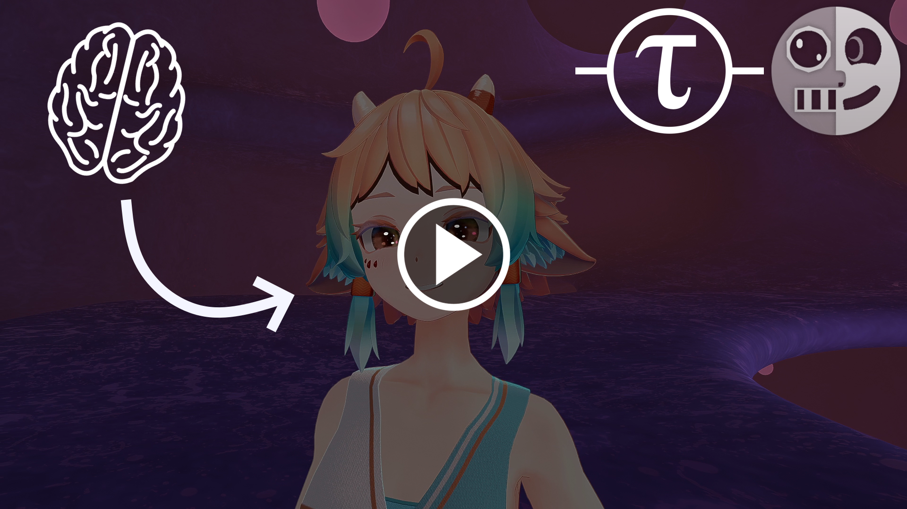
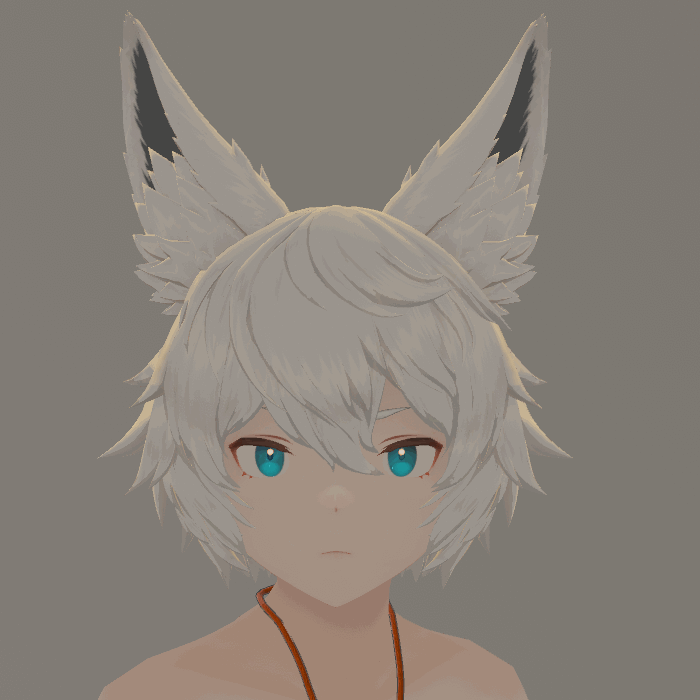

# BFI VRCFT Module 🧠

A VRCFT module that let's you control VRCFT avatars using BFI expression actions controlled by your brain 🧠

[](https://youtu.be/YbaF6A0G3T8)


## Supported expressions

>List of supported expressions not set in stone yet

| Reference                                           | Expression          | Description                                               |
|:---:                                                | :-------------:     |    :-------------:                                        |
|  | eyeclosed           |  eyelids closing fully                                    |
|          | smile               | smile with mouth opened                                   |
|          | frown               | n shaped frown                                            |
|          | anger               | brow going down                                           |
|        | cringe              | mouth stretches and reveles the bottom teeth              |
|  | cheekpuff           | cheek puffs                                               |
|    | apeshape            | lower jaw while keeping the mouth closed                  |

## How to use 🤔

### 1 - Train your expressions as BFI Actions :

Make sure you've trained your actions

[Here's BFI's documentation](https://github.com/ChilloutCharles/BrainFlowsIntoVRChat/wiki/Action-Classification-Instructions) on how to train your own actions


### 2 - Launch BFI to output to your configured port 💨

Here's the command to launch BFI with the right launch option if you leave the port on the default setting:

`python .\main.py ----osc-port 8999`

>Using an OSC mixer is recomended to remain compatibility with your BFI parameters compatible avatar

⚠️The port can be configured at the bottom of `config.json`

### 3 - Install the module 📁

Go to VRCFT's modules registery tab, click the `+` button and select the latest release of the module 📁

### 4 - Configured your supported expressions based on your trained actions

config.json must be in the same folder as the module and is used to define which expressions you have trained and which action number it's assigned to and it's overhall weight.

Here's an exemple of a config.json supporting all of the supported expressions thus far:


```
{
  "supportedexpressions": {
    "eyeclosed": {
      "id": 1,
      "weight": 1.0
    },
    "smile": {
      "id": 2,
      "weight": 1.0
    },
    "frown": {
      "id": 3,
      "weight": 1.0
    },
    "anger": {
      "id": 4,
      "weight": 1.0
    },
    "cringe": {
      "id": 5,
      "weight": 1.0
    },
    "cheekpuff": {
      "id": 6,
      "weight": 1.0
    },
    "apeshape": {
      "id": 7,
      "weight": 1.0
    }
  },
  "ip": "127.0.0.1",
  "port": 8999,
  "timouttime": 3.0
}
```


